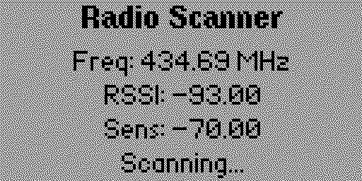

# Walkie Talkie — FRS Channel Scanner for Flipper Zero

> **Audio limitation:** The CC1101 data mirror is a digital receive-data stream, not
> demodulated analog voice. Treat this app as a channel activity/RSSI scanner unless
> external demodulation hardware is added; speaker output is not reliable FRS voice.

📻 Listen in on FRS walkie-talkie channels with your Flipper Zero. Tunes the built-in CC1101 radio to the 22 standard FRS channels and plays whatever it hears through the speaker, with auto-squelch and a channel scanner.

> **Receive-only.** This app does not transmit, and it does not decode CTCSS/DCS — subchannel numbers are labels for matching your handheld radio's display, not a privacy-code filter.
>
> It also cannot play FM broadcast radio; those frequencies are outside the CC1101's supported bands.

## ✨ Features

- All 22 standard FRS channels (462/467 MHz) with a scrollable channel list.
  The seven 467 MHz interstitial channels (8–14) sit outside the CC1101's
  supported bands: on official firmware they are skipped and shown as "N/A",
  while extended-range firmwares (e.g. Unleashed, Momentum) can tune them
- Channel scanner: scans up or down, pauses automatically when a signal is detected, and resumes after the transmission ends
- Auto-squelch with adjustable sensitivity (or turn it off to hear raw static)
- Live RSSI readout with a 5-bar signal-strength meter
- Subchannel (privacy-code) labels 1–38 for quick reference

## 📸 Screenshots

| Listen Now | Settings |
|---|---|
|  |  |

| FRS Channel List | About |
|---|---|
|  |  |

## 🎛️ Controls

### Listen Now (main screen)

| Button | Short press | Long press |
|---|---|---|
| Up / Down | Channel up / down | Squelch sensitivity + / − |
| Left / Right | Subchannel − / + (0 = none) | Scan direction down / up |
| OK | Mute / unmute | Start, resume, or stop scanning |
| Back | Open menu | Exit app |

### Menu / FRS List / Settings

| Button | Action |
|---|---|
| Up / Down | Move cursor |
| OK | Select (in FRS List: tune to the highlighted channel) |
| Left / Right | Settings: toggle Auto-Squelch or adjust sensitivity |
| Back | Back to previous screen (long press exits the app) |

## 🔧 Building from source

Requires [ufbt](https://github.com/flipperdevices/flipperzero-ufbt) (micro Flipper Build Tool):

```sh
pip install ufbt
cd Walkie_Talkie
ufbt          # builds walkie_talkie.fap into dist/
ufbt launch   # builds, installs to a connected Flipper, and runs it
```

## 📦 Installing a release

Copy `walkie_talkie.fap` to your Flipper's SD card under `apps/Sub-GHz/`, then launch it from **Apps → Sub-GHz → Walkie Talkie**.

## ⚖️ Legal note

Receiving FRS transmissions is legal in most jurisdictions, but laws vary — check your local regulations. This app never transmits.

## 🤔 To do

- Consider a custom radio preset to improve audio quality

## 👤 Author

Made by **coolshrimp** (Coolshrimp Modz)
